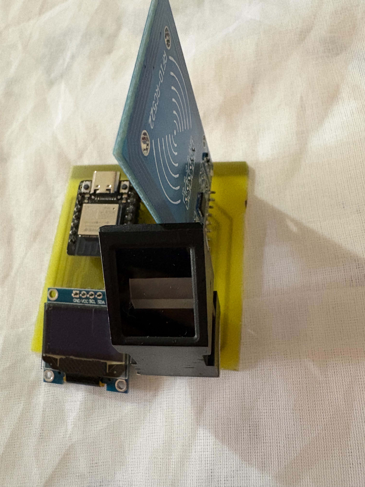
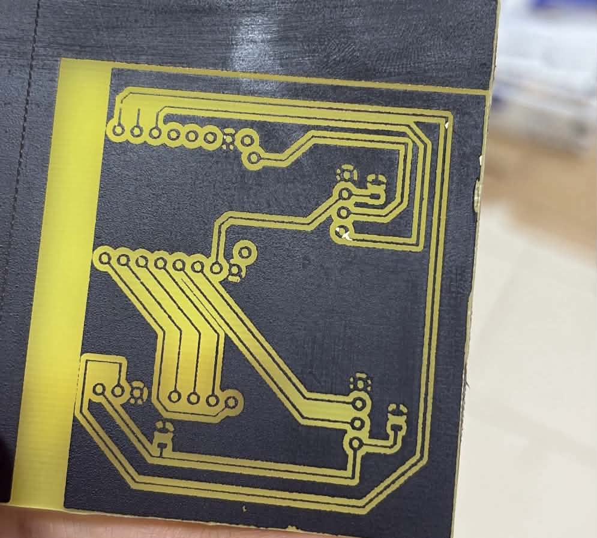
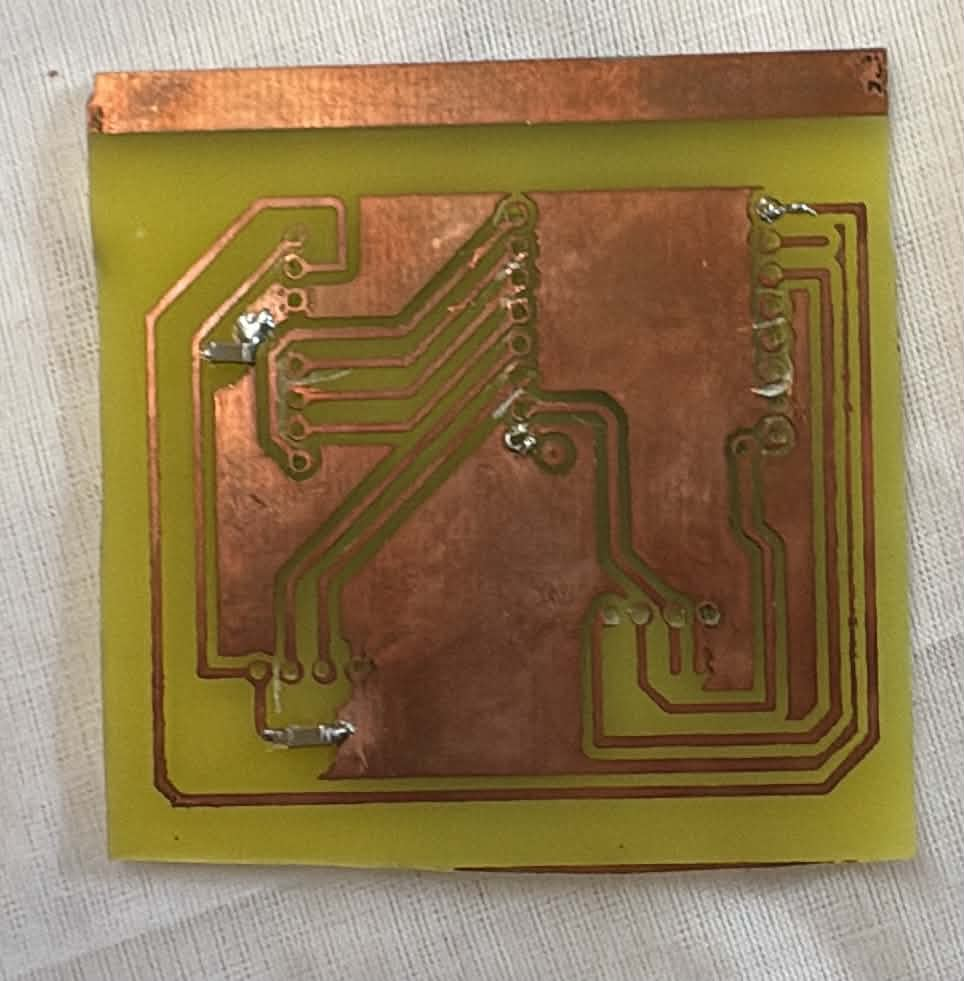

# RemoteSignLab

RemoteSignLab is an academic prototype for secure remote electronic signatures.

It combines strong user authentication on an ESP32-C3 hardware terminal with a server-side RSA signing key protected through PKCS#11 and SoftHSM. The platform produces verifiable PAdES PDF signatures and includes a complete audit trail for traceability.

The prototype also includes a custom PCB designed with KiCad and manufactured using a laser-assisted resist process with an Emblaser 2 followed by chemical etching.

---

## Features

- FastAPI backend
- PostgreSQL database
- ESP32-C3 authentication terminal
- RFID authentication with MFRC522
- Fingerprint authentication with DY50
- SSD1306 OLED display
- HMAC-SHA256 device authentication
- Timestamp and nonce anti-replay protection
- Persistent nonce protection
- Separate USER and ADMIN interfaces
- Explicit user consent workflow
- Signature-request queue
- SoftHSM2 integration through PKCS#11
- Server-side RSA signing key protection
- PAdES-B-B signatures
- PAdES-B-T signatures
- RFC 3161 timestamp authority integration
- Signed PDF verification
- Security audit trail
- Tamper-evident SHA-256 audit hash chain
- PostgreSQL advisory-lock serialization for audit events
- ADMIN audit interface with filtering and pagination
- Audit integrity verification
- CSV audit export
- Custom KiCad PCB
- Laser-assisted PCB fabrication
- Chemical PCB etching

---

## Architecture


FastAPI coordinates authentication, authorization, consent, document management, signature requests and signature generation.

PostgreSQL stores users, devices, documents, authentication sessions, nonces, signature requests, signature metadata and security audit events.

The ESP32-C3 authenticates the user locally through RFID and fingerprint verification and authenticates sensitive requests to the backend using HMAC-SHA256.

The private signing key is never stored on the ESP32-C3. It remains protected on the server side through PKCS#11 and SoftHSM.

pyHanko generates and validates the resulting PAdES documents, while the RFC 3161 TSA provides the timestamp required for PAdES-B-T.

---

## Authentication and Signature Flow

1. The USER signs in to the Web interface.
2. The USER opens an assigned PDF document.
3. The USER explicitly accepts the consent conditions.
4. RemoteSignLab creates a signature request.
5. The ESP32-C3 retrieves the pending request.
6. The terminal verifies the RFID card.
7. The terminal verifies the fingerprint.
8. The server issues an authentication challenge.
9. Device requests are authenticated using HMAC-SHA256.
10. A timestamp and persistent nonce protect requests against replay attacks.
11. The backend validates the complete authentication context.
12. The signature request becomes authorized.
13. SoftHSM performs the RSA signing operation through PKCS#11.
14. pyHanko creates the PAdES signature.
15. The RFC 3161 TSA provides a trusted timestamp when PAdES-B-T is enabled.
16. The signed PDF becomes available to the USER.
17. The complete workflow is recorded in the security audit trail.

No credential, device secret, PIN or private key is stored in this README or committed to the repository.

---

## Hardware Prototype

RemoteSignLab includes a custom hardware authentication terminal designed around an ESP32-C3.

The terminal integrates:

- DFRobot Beetle ESP32-C3
- MFRC522 RFID reader
- DY50 fingerprint sensor
- SSD1306 0.96-inch OLED display
- Custom PCB designed with KiCad

The hardware terminal is responsible for the local authentication steps required before a remote signature can be authorized by the backend.

### Prototype

<p align="center">
  
</p>

The prototype combines the ESP32-C3, RFID reader, fingerprint sensor and OLED display on a dedicated PCB.

---

## PCB Design

The electronic schematic and PCB layout were designed with KiCad.

The editable KiCad source files are stored under:

[`hardware/kicad/`](hardware/kicad/)

### Main KiCad Files

- [KiCad schematic](hardware/kicad/remotesign_lab.kicad_sch)
- [KiCad PCB layout](hardware/kicad/remotesign_lab.kicad_pcb)

If a KiCad project file is added later, it can also be stored in the same directory as:

```text
remotesign_lab.kicad_pro
```

---

## Electronic Schematic

The schematic connects the main authentication and user-interface modules:

- ESP32-C3
- MFRC522 RFID reader
- DY50 fingerprint sensor
- SSD1306 OLED display
- Power connections
- I2C communication
- SPI communication
- UART communication

The exported schematic is available here:

[View the schematic PDF](hardware/fabrication/schematic.pdf)

The editable source is available here:

[Open the KiCad schematic](hardware/kicad/remotesign_lab.kicad_sch)

---

## PCB Routing

The PCB routing was designed in KiCad and optimized for local prototype fabrication.

The editable PCB file is available here:

[Open the KiCad PCB layout](hardware/kicad/remotesign_lab.kicad_pcb)

The routing was prepared so that the board could be manufactured manually using a copper-clad board, black resist coating, laser engraving and chemical etching.

---

## PCB Fabrication

The PCB was manufactured manually rather than ordered from an industrial PCB manufacturer.

The process combines:

- KiCad PCB design
- Copper-layer export
- Black-and-white image processing
- Image inversion
- Black paint used as temporary resist
- Emblaser 2 laser engraving
- Chemical copper etching
- Manual drilling
- Component soldering
- Electrical continuity testing
- Functional testing

### Fabrication Process

The fabrication workflow was:

1. Create the electronic schematic in KiCad.
2. Assign footprints to the components.
3. Route the PCB in KiCad.
4. Export the copper layer.
5. Convert the layout to a high-contrast black-and-white image.
6. Invert the image for the resist-removal process.
7. Apply black paint to the copper-clad board.
8. Allow the coating to dry.
9. Position and focus the board in the Emblaser 2.
10. Laser-engrave the inverted PCB pattern.
11. Remove the resist only from the copper areas that must be etched.
12. Place the board in the chemical etching solution.
13. Remove the exposed unwanted copper.
14. Clean the remaining resist from the PCB.
15. Drill the component pads and required holes.
16. Inspect track continuity.
17. Solder the electronic components.
18. Perform electrical and functional tests.

---

## Laser Engraving Pattern

The copper layout was inverted before laser engraving because the black coating acts as a temporary chemical-etching resist.

The laser removes the coating from the areas where copper must later be removed by the chemical etchant.

The inverted fabrication file is available here:

[View the inverted copper layout](hardware/fabrication/copper-layout-inverted.pdf)

---

## PCB After Laser Engraving

<p align="center">
  
</p>

At this stage, the Emblaser 2 has removed selected areas of the black resist coating according to the inverted copper layout.

The exposed copper will be removed during the chemical etching stage.

---

## PCB After Chemical Etching

<p align="center">
  
</p>

After chemical etching, the unwanted exposed copper is removed.

The copper protected by the remaining resist forms the final conductive tracks of the PCB.

The board can then be cleaned, drilled and assembled.

---

## Hardware Design Files

The hardware files are organized as follows:

```text
hardware/
├── kicad/
│   ├── remotesign_lab.kicad_sch
│   └── remotesign_lab.kicad_pcb
│
└── fabrication/
    ├── schematic.pdf
    └── copper-layout-inverted.pdf
```

Prototype and PCB photographs are stored under:

```text
docs/images/
├── prototype/
│   └── prototype-complete.jpg
│
└── pcb/
    ├── pcb-after-laser.jpg
    └── pcb-after-etching.jpg
```

---

## Repository Structure

| Path | Purpose |
| --- | --- |
| `app/` | FastAPI application, APIs, Web interfaces, security modules and services |
| `alembic/` | PostgreSQL database migrations |
| `firmware/` | ESP32-C3 firmware and safe configuration templates |
| `hardware/kicad/` | Editable KiCad schematic and PCB design |
| `hardware/fabrication/` | PCB fabrication exports and laser patterns |
| `docs/images/` | Prototype and PCB photographs |
| `scripts/` | Development utilities, certificate tools and development TSA |
| `tests/` | Automated tests |
| `docs/` | PAdES, TSA, certificate and audit documentation |
| `softhsm/` | Safe SoftHSM configuration; runtime tokens are excluded |

---

## Software Requirements

- Python 3
- PostgreSQL
- SoftHSM2
- PKCS#11 module
- OpenSSL
- ESP32-C3 Arduino-compatible development environment
- KiCad for PCB design

Pinned Python dependencies are listed in:

[`requirements.txt`](requirements.txt)

---

## Installation

Create the Python virtual environment:

```bash
python3 -m venv .venv
source .venv/bin/activate
```

Install the Python dependencies:

```bash
pip install -r requirements.txt
```

Create the local application configuration:

```bash
cp .env.example .env
```

Replace every placeholder in `.env` with the appropriate local value.

Never commit `.env` or any secret referenced by it.

---

## Database

Apply the database migrations before starting the backend:

```bash
alembic upgrade head
```

The current audit-hardening migration is:

```text
a84f2c1d9e70
```

---

## Running the Backend

Start the HTTPS FastAPI backend with local TLS files that are not tracked by Git:

```bash
uvicorn app.main:app \
  --host 0.0.0.0 \
  --port 8443 \
  --ssl-keyfile certs/server.key \
  --ssl-certfile certs/server.crt
```

The private TLS key must remain outside version control.

---

## Development TSA

For local PAdES-B-T development, start the RFC 3161 development TSA separately:

```bash
python -m scripts.dev_tsa_server \
  --config scripts/dev-tsa-openssl.cnf \
  --bind 127.0.0.1 \
  --port 8090
```

The development TSA and development certificates are intended only for testing and demonstration.

They must not be treated as a production PKI.

---

## Firmware Configuration

Firmware credentials and the local trust anchor are intentionally excluded from Git.

Create the local files from the provided templates:

```bash
cp firmware/remotesign_lab/secrets.example.h \
   firmware/remotesign_lab/secrets.h

cp firmware/remotesign_lab/trust_anchor.example.h \
   firmware/remotesign_lab/trust_anchor.h
```

Configure local Wi-Fi credentials and the device authentication secret only in:

```text
firmware/remotesign_lab/secrets.h
```

Configure the local CA certificate used to validate the HTTPS backend in:

```text
firmware/remotesign_lab/trust_anchor.h
```

These files must never be committed.

TLS certificate validation remains enabled.

The firmware loads the trusted CA certificate with:

```cpp
secureClient.setCACert(SERVER_CA_CERT);
```

Do not replace certificate validation with:

```cpp
setInsecure();
```

---

## Security Model

RemoteSignLab applies multiple security mechanisms across the device, backend and signing infrastructure.

### Device Authentication

Sensitive ESP32-C3 requests are authenticated using:

- HMAC-SHA256
- Timestamp validation
- Random nonces
- Persistent nonce replay detection
- Device identity binding
- Document identity binding
- Document hash binding
- Explicit approval context

### User Authentication

The signing terminal combines:

- RFID authentication
- Fingerprint authentication

Both factors are validated before the remote signing operation is authorized.

### Signing Key Protection

The private RSA signing key:

- Is never stored on the ESP32-C3
- Is not stored directly in application source code
- Is accessed through PKCS#11
- Is protected by SoftHSM in the prototype environment

### TLS

ESP32-C3 communications with the backend use HTTPS with server-certificate validation.

No insecure TLS fallback is used.

### Anti-Replay Protection

Timestamp and persistent nonce validation are used to reject replayed device requests.

### Audit Trail

Security-sensitive events are written to the audit log.

The audit implementation includes:

- Structured event categories
- Actor identification
- Business correlation
- Failure codes
- Sanitization of sensitive fields
- SHA-256 hash chaining
- PostgreSQL advisory locking
- Integrity verification
- ADMIN-only audit access
- CSV export

The audit hash chain provides tamper evidence.

It does not provide absolute immutability against an administrator with unrestricted database access.

---

## Sensitive Data Policy

The following data must never be committed:

- `.env`
- Wi-Fi credentials
- `DEVICE_SECRET`
- `secrets.h`
- `trust_anchor.h`
- SoftHSM PINs
- SoftHSM runtime tokens
- Private TLS keys
- Private CA keys
- Private TSA keys
- Private signing keys
- Session tokens
- CSRF tokens
- Administrative API secrets

The repository contains safe templates only.

---

## PAdES Signatures

RemoteSignLab supports:

### PAdES-B-B

A basic PAdES signature containing the cryptographic PDF signature and signer certificate information.

### PAdES-B-T

A PAdES signature extended with an RFC 3161 timestamp token.

Future visible PDF signatures include:

```text
ELECTRONICALLY SIGNED
RemoteSignLab
Signer
Certificate
Profile
Date
Signature ID
```

Existing signed PDFs are not modified.

---

## Audit Integrity

New audit events are linked through a SHA-256 hash chain.

Each event contains:

```text
previous_hash
event_hash
```

Audit writes are serialized using a PostgreSQL transaction-level advisory lock.

Historical audit events created before hash chaining remain unsealed and are not artificially backfilled.

The ADMIN interface provides an integrity-check endpoint that recalculates the chain without modifying the database.

---

## Tests

Compile Python modules:

```bash
python -m compileall app scripts
```

Run the automated test suite:

```bash
pytest
```

Check installed Python dependencies:

```bash
pip check
```

Check known dependency vulnerabilities:

```bash
pip-audit -r requirements.txt
```

Run the static security analysis:

```bash
bandit -r app scripts -x tests
```

Check Git whitespace consistency:

```bash
git diff --check
```

Current baseline:

```text
143 tests passing
```

---

## Security Scan Status

The current validated baseline includes:

```text
pytest:
143 passed

pip check:
No broken requirements found

pip-audit:
No known vulnerabilities found

Bandit:
0 High
0 Medium
2 Low
```

The two remaining Low-severity Bandit findings are associated with the local development TSA invoking OpenSSL through Python `subprocess` without shell execution.

---

## Stable Versions

The repository contains stable development milestones:

- `pades-bt-stable`
- `audit-hardening-stable`

---

## Documentation

Additional technical documentation is available here:

- [PAdES implementation](docs/pades.md)
- [Development signing certificate](docs/pades-test-certificate.md)
- [Development RFC 3161 TSA](docs/pades-test-tsa.md)
- [Audit trail and hash chain](docs/audit.md)

---

## Development Scope

RemoteSignLab is intended as an academic and demonstration prototype.

The current project demonstrates:

- Secure remote signature workflow
- Multi-factor hardware authentication
- Device-to-server authenticated communication
- PKCS#11 signing
- PAdES electronic signatures
- RFC 3161 timestamps
- Security audit logging
- Tamper-evident audit chaining
- Embedded development
- PCB design
- Local PCB fabrication
- Laser engraving
- Chemical PCB etching

---

## Disclaimer

RemoteSignLab is an academic and demonstration prototype.

Its development certificates, development TSA, SoftHSM configuration, locally manufactured PCB and trust model must not be considered equivalent to a production PKI, certified HSM or qualified electronic-signature service.

Production deployment would require additional controls such as hardened key-management infrastructure, secure device provisioning, production PKI, operational monitoring and an appropriate regulatory and certification framework.
