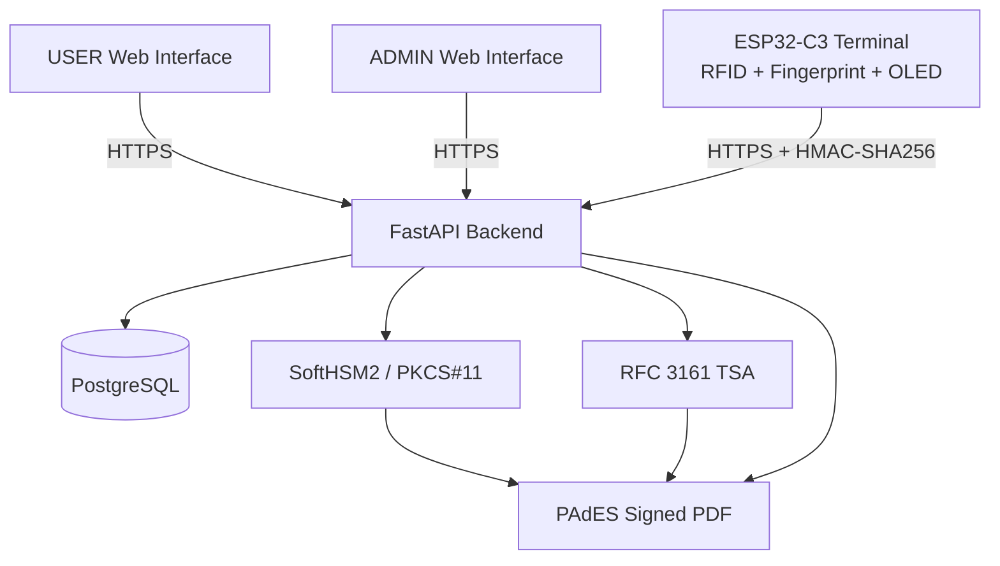
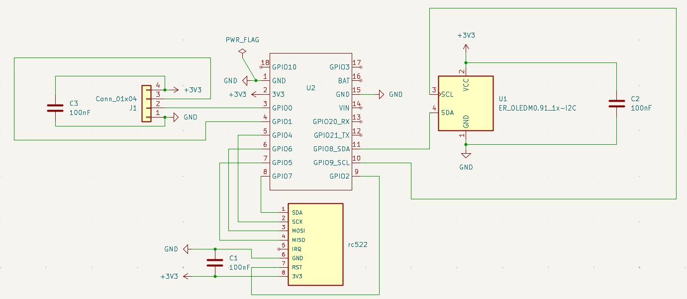
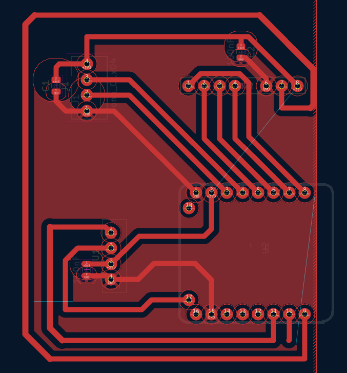

# RemoteSignLab

RemoteSignLab is an academic prototype for **secure remote electronic signatures** combining a hardware authentication terminal, a FastAPI backend, PKCS#11-based key protection, PAdES PDF signatures, RFC 3161 timestamps, and tamper-evident security auditing.

The system uses an **ESP32-C3 terminal with RFID and fingerprint authentication** to authorize signing requests, while the RSA signing key remains protected on the server side through **SoftHSM2 and PKCS#11**.

The project also includes a custom PCB designed with KiCad and manufactured locally using an **Emblaser 2 laser-assisted resist process followed by chemical etching**.

---

## Project Highlights

### Secure remote signing

- PAdES-B-B and PAdES-B-T PDF signatures
- RSA signing through PKCS#11
- SoftHSM2-protected signing key
- RFC 3161 timestamp authority integration
- Signed PDF integrity and signature verification

### Strong user authentication

- ESP32-C3 authentication terminal
- MFRC522 RFID reader
- DY50 fingerprint sensor
- SSD1306 OLED display
- Explicit user consent before signature authorization

### Device security

- HMAC-SHA256 authenticated requests
- Timestamp validation
- Persistent nonce anti-replay protection
- Device, document and approval-context binding
- HTTPS with server certificate validation

### Backend and audit

- FastAPI
- PostgreSQL
- Separate USER and ADMIN interfaces
- Signature-request queue
- Structured security audit events
- SHA-256 tamper-evident audit hash chain
- PostgreSQL advisory-lock serialization
- ADMIN audit filtering, pagination and CSV export
- Audit-chain integrity verification

### Hardware development

- Custom KiCad schematic
- Custom PCB routing
- ESP32-C3 / RFID / fingerprint / OLED integration
- Emblaser 2 laser engraving
- Chemical PCB etching
- Manual drilling, soldering and testing

---

# System Architecture



The FastAPI backend coordinates authentication, authorization, user consent, document management, signature requests, signing and verification.

PostgreSQL stores application and workflow data, including users, devices, documents, authentication sessions, nonces, signature requests, signature metadata and security audit events.

The ESP32-C3 terminal performs the local authentication steps and authenticates sensitive requests to the backend using HMAC-SHA256.

The private RSA signing key is never stored on the ESP32-C3. It remains protected behind the PKCS#11 interface provided by SoftHSM2.

pyHanko generates and validates the PAdES signatures. For PAdES-B-T, an RFC 3161 TSA provides the signature timestamp.

---

# End-to-End Signature Flow

1. The USER signs in to the Web interface.
2. The USER opens an assigned PDF document.
3. The USER explicitly accepts the consent conditions.
4. RemoteSignLab creates a signature request.
5. The ESP32-C3 retrieves the pending request.
6. The terminal verifies the RFID card.
7. The terminal verifies the fingerprint.
8. The backend issues an authentication challenge.
9. Device requests are authenticated using HMAC-SHA256.
10. Timestamp and persistent nonce checks protect against replay attacks.
11. The backend validates the device, document, hash and approval context.
12. The signature request becomes authorized.
13. SoftHSM2 performs the RSA operation through PKCS#11.
14. pyHanko generates the PAdES signature.
15. The RFC 3161 TSA provides a timestamp for PAdES-B-T.
16. The signed PDF becomes available to the USER.
17. Security-sensitive operations are recorded in the audit trail.

No credential, device secret, HSM PIN or private key is stored in this README or intentionally committed to the repository.

---

# Hardware Prototype

RemoteSignLab includes a dedicated authentication terminal based on the **DFRobot Beetle ESP32-C3**.

## Main Components

| Component | Purpose |
| --- | --- |
| DFRobot Beetle ESP32-C3 | Main embedded controller |
| MFRC522 | RFID authentication |
| DY50 | Fingerprint authentication |
| SSD1306 0.96" OLED | Local status and workflow display |
| Custom PCB | Electrical integration of the terminal |

The terminal performs the local authentication operations required before the backend can authorize a remote electronic signature.

## Prototype

<p align="center">
  
</p>

The prototype combines the ESP32-C3, RFID reader, fingerprint sensor and OLED display on a custom PCB.

---

# PCB Design

The PCB was designed with **KiCad**.

Editable design files are available in:

[`hardware/kicad/`](hardware/kicad/)

## KiCad Files

- [Electronic schematic](hardware/kicad/remotesign_lab.kicad_sch)
- [PCB layout](hardware/kicad/remotesign_lab.kicad_pcb)

---

## Electronic Schematic

The schematic integrates:

- ESP32-C3
- MFRC522 RFID reader
- DY50 fingerprint sensor
- SSD1306 OLED display
- Power distribution
- SPI communication
- UART communication
- I2C communication

### Schematic Preview

<p align="center">
  
</p>

The complete exported schematic is also available as PDF:

[View schematic PDF](hardware/fabrication/schematic.pdf)

---

## PCB Routing

The PCB routing was designed specifically for local prototype fabrication.

### Routing Preview

<p align="center">
  
</p>

The editable KiCad PCB file is available here:

[Open the PCB layout](hardware/kicad/remotesign_lab.kicad_pcb)

---

# PCB Fabrication

The PCB was fabricated locally rather than ordered from an industrial PCB manufacturer.

The manufacturing process combines:

- KiCad PCB design
- Copper-layer export
- Black-and-white image processing
- Pattern inversion
- Black resist coating
- Emblaser 2 laser engraving
- Chemical copper etching
- Manual drilling
- Component soldering
- Electrical continuity testing
- Functional testing

## Fabrication Workflow

1. Create the electronic schematic in KiCad.
2. Assign footprints to all components.
3. Place and route the PCB.
4. Export the copper layer.
5. Convert the layout to a high-contrast black-and-white image.
6. Invert the copper pattern for the resist-removal process.
7. Coat the copper-clad board with black paint.
8. Allow the coating to dry.
9. Position and focus the board in the Emblaser 2.
10. Laser-engrave the inverted PCB pattern.
11. Remove the resist from the areas where copper must be etched.
12. Place the board in the chemical etching solution.
13. Remove the exposed unwanted copper.
14. Clean the remaining resist.
15. Drill the pads and component holes.
16. Inspect track continuity.
17. Solder the electronic components.
18. Perform electrical and functional tests.

---

## Laser Engraving Pattern

The copper layout is inverted before laser engraving because the black coating acts as a temporary chemical-etching resist.

The Emblaser 2 removes the coating only from the areas where copper must later be removed by the etchant.

The fabrication pattern is available here:

[View inverted copper layout](hardware/fabrication/copper-layout-inverted.pdf)

---

## After Laser Engraving

<p align="center">
  
</p>

At this stage, the laser has selectively removed the black resist coating.

The exposed copper areas will be removed during chemical etching.

---

## After Chemical Etching

<p align="center">
  
</p>

After chemical etching, the unwanted copper has been removed.

The remaining copper protected by the resist forms the conductive PCB tracks.

The board can then be cleaned, drilled, assembled and electrically tested.

---

# Hardware Files

```text
hardware/
├── kicad/
│   ├── remotesign_lab.kicad_sch
│   └── remotesign_lab.kicad_pcb
│
└── fabrication/
    ├── schematic.pdf
    └── copper-layout-inverted.pdf
```

Hardware images are stored under:

```text
docs/images/
├── prototype/
│   └── prototype-complete.jpg
│
└── pcb/
    ├── schematic.png
    ├── pcb-routing.png
    ├── pcb-after-laser.jpg
    └── pcb-after-etching.jpg
```

---

# Repository Structure

| Path | Purpose |
| --- | --- |
| `app/` | FastAPI backend, APIs, Web interfaces, security modules and services |
| `alembic/` | PostgreSQL database migrations |
| `firmware/remotesign_lab/` | ESP32-C3 firmware and safe configuration templates |
| `hardware/kicad/` | Editable KiCad schematic and PCB layout |
| `hardware/fabrication/` | PCB fabrication exports and laser patterns |
| `docs/images/` | Hardware prototype and PCB images |
| `docs/` | PAdES, TSA, certificate and audit documentation |
| `scripts/` | Development utilities, certificate tools and development TSA |
| `tests/` | Automated test suite |
| `softhsm/` | Safe SoftHSM configuration; runtime tokens are excluded |

---

# Software Requirements

- Python 3
- PostgreSQL
- SoftHSM2
- PKCS#11 module
- OpenSSL
- ESP32-C3 Arduino-compatible development environment
- KiCad

Pinned Python dependencies are listed in:

[`requirements.txt`](requirements.txt)

---

# Installation

## Python Environment

```bash
python3 -m venv .venv
source .venv/bin/activate
pip install -r requirements.txt
```

## Application Configuration

Create a local configuration file:

```bash
cp .env.example .env
```

Replace all placeholders in `.env` with appropriate local values.

The `.env` file must never be committed.

---

# Database

Apply the database migrations:

```bash
alembic upgrade head
```

The current audit-hardening migration is:

```text
a84f2c1d9e70
```

---

# Running RemoteSignLab

## Backend

Start the FastAPI backend over HTTPS:

```bash
uvicorn app.main:app \
  --host 0.0.0.0 \
  --port 8443 \
  --ssl-keyfile certs/server.key \
  --ssl-certfile certs/server.crt
```

TLS private keys are local files and must remain outside version control.

---

## Development RFC 3161 TSA

For local PAdES-B-T development:

```bash
python -m scripts.dev_tsa_server \
  --config scripts/dev-tsa-openssl.cnf \
  --bind 127.0.0.1 \
  --port 8090
```

The development TSA and its certificates are intended only for testing and demonstration.

They are not a production PKI.

---

# Firmware Configuration

Firmware credentials and the local HTTPS trust anchor are intentionally excluded from Git.

Create them from the safe templates:

```bash
cp firmware/remotesign_lab/secrets.example.h \
   firmware/remotesign_lab/secrets.h

cp firmware/remotesign_lab/trust_anchor.example.h \
   firmware/remotesign_lab/trust_anchor.h
```

Local Wi-Fi credentials and the device authentication secret must only be stored in:

```text
firmware/remotesign_lab/secrets.h
```

The local CA certificate used to validate the HTTPS server belongs in:

```text
firmware/remotesign_lab/trust_anchor.h
```

Both files are excluded from version control.

TLS certificate validation remains enabled through:

```cpp
secureClient.setCACert(SERVER_CA_CERT);
```

The firmware must not use:

```cpp
setInsecure();
```

---

# Security Architecture

RemoteSignLab applies security controls at the device, communication, backend, signing and auditing layers.

## Device Authentication

Sensitive ESP32-C3 requests are protected using:

- HMAC-SHA256
- Timestamp validation
- Random nonces
- Persistent nonce replay detection
- Device identity binding
- Document identity binding
- Document hash binding
- Explicit approval context

---

## Multi-Factor Authentication

The hardware terminal combines:

- RFID authentication
- Fingerprint authentication

Both checks are required before the remote signing workflow can proceed.

---

## Signing Key Protection

The private RSA signing key:

- Is never stored on the ESP32-C3
- Is never embedded in the application source code
- Is accessed through PKCS#11
- Is protected by SoftHSM2 in the prototype environment

---

## TLS

Communication between the ESP32-C3 and FastAPI backend uses HTTPS with server certificate validation.

No insecure TLS fallback is used.

---

## Anti-Replay Protection

Device requests include:

- Timestamps
- Random nonces

Used nonces are persisted to prevent replay across application restarts.

---

# PAdES Signatures

RemoteSignLab supports two PAdES profiles.

## PAdES-B-B

Provides the cryptographic PDF signature and signer certificate information.

## PAdES-B-T

Extends the signature with an RFC 3161 timestamp token.

Future visible PDF signatures include:

```text
ELECTRONICALLY SIGNED
RemoteSignLab

Signer
Certificate
Profile
Date
Signature ID
```

Existing signed PDFs are never modified.

---

# Security Audit Trail

Security-sensitive operations are recorded in a structured audit trail.

The audit system includes:

- Event categories
- Actor identification
- User, device, document, request and signature correlation
- Technical failure codes
- Sensitive-data sanitization
- HTTP request context
- SHA-256 hash chaining
- PostgreSQL advisory locking
- Integrity verification
- ADMIN-only access
- Filtering and pagination
- CSV export

---

## Tamper-Evident Audit Chain

New audit events contain:

```text
previous_hash
event_hash
```

The hash chain provides evidence of database-event modification.

Audit writes are serialized through a PostgreSQL transaction-level advisory lock to prevent concurrent events from referencing the same previous hash.

Historical events created before hash chaining remain unsealed and are not artificially modified.

The integrity checker recalculates the chain in read-only mode.

> The audit hash chain provides tamper evidence, not absolute immutability against an administrator with unrestricted database access.

---

# Sensitive Data Policy

The following data must never be committed:

- `.env`
- Wi-Fi credentials
- `DEVICE_SECRET`
- `secrets.h`
- `trust_anchor.h`
- SoftHSM PINs
- SoftHSM runtime tokens
- Private TLS keys
- Private CA keys
- Private TSA keys
- Private signing keys
- Authentication tokens
- Session tokens
- CSRF tokens
- Administrative secrets

Only safe templates are included in the repository.

---

# Testing

## Compile

```bash
python -m compileall app scripts
```

## Automated Tests

```bash
pytest
```

Current validated baseline:

```text
143 tests passing
```

## Dependency Consistency

```bash
pip check
```

## Dependency Security Audit

```bash
pip-audit -r requirements.txt
```

## Static Security Analysis

```bash
bandit -r app scripts -x tests
```

## Git Consistency

```bash
git diff --check
```

---

# Security Validation Status

Current validated baseline:

| Check | Result |
| --- | --- |
| Automated tests | 143 passed |
| `pip check` | No broken requirements |
| `pip-audit` | No known vulnerabilities |
| Bandit High | 0 |
| Bandit Medium | 0 |
| Bandit Low | 2 |
| Git whitespace check | Passed |

The two remaining Low-severity Bandit findings are associated with the local development TSA invoking OpenSSL through Python `subprocess` without shell execution.

---

# Stable Milestones

The repository includes the following stable development tags:

- `pades-bt-stable`
- `audit-hardening-stable`

---

# Technical Documentation

- [PAdES implementation](docs/pades.md)
- [Development signing certificate](docs/pades-test-certificate.md)
- [Development RFC 3161 TSA](docs/pades-test-tsa.md)
- [Audit trail and hash chain](docs/audit.md)

---

# Project Scope

RemoteSignLab demonstrates a complete academic remote-signature workflow covering:

- Web application development
- Embedded systems
- Multi-factor authentication
- Secure device-to-server communication
- HMAC-based device authentication
- Anti-replay mechanisms
- PKCS#11
- SoftHSM2
- RSA signatures
- PAdES
- RFC 3161 timestamping
- Security audit logging
- Tamper-evident audit chains
- KiCad schematic design
- PCB routing
- PCB prototyping
- Laser engraving
- Chemical etching

---

# Disclaimer

RemoteSignLab is an **academic and demonstration prototype**.

Its development certificates, development TSA, SoftHSM2 configuration, locally manufactured PCB and trust model must not be considered equivalent to:

- A production PKI
- A certified hardware security module
- A qualified trust service provider
- A qualified electronic-signature service

A production deployment would require additional controls such as secure hardware key storage, hardened provisioning, production PKI, device lifecycle management, operational monitoring, high-availability infrastructure and the appropriate regulatory and certification framework.
