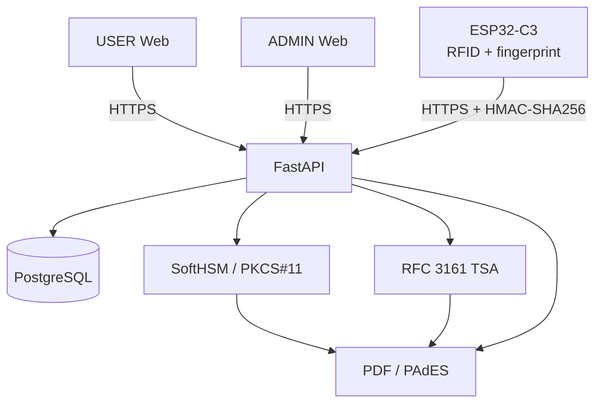

# RemoteSignLab

RemoteSignLab is an academic prototype for remote electronic signatures. It
combines strong user authentication with a server-side RSA signing key
protected through PKCS#11 and SoftHSM, and produces verifiable PAdES PDF
signatures.


## Features

- FastAPI backend with PostgreSQL persistence
- ESP32-C3 signing terminal
- RFID and fingerprint authentication
- HMAC-SHA256 device authentication
- Timestamp and nonce anti-replay checks with persistent nonce protection
- Separate USER and ADMIN Web experiences
- Explicit user consent workflow and signature-request queue
- SoftHSM2 integration through PKCS#11
- RSA signing key protected on the server side
- PAdES-B-B and PAdES-B-T signed PDFs
- RFC 3161 timestamp authority integration
- Signed PDF verification
- Security audit trail with a tamper-evident SHA-256 hash chain
- PostgreSQL advisory lock serialization for concurrent audit writers
- ADMIN audit UI with filtering, integrity checking, and CSV export

## Architecture



FastAPI coordinates authorization and the signing workflow. PostgreSQL
stores users, documents, nonces, signature requests, signature metadata,
and audit events. The ESP32-C3 authenticates the user locally and
authenticates every device request to the backend. The signing key remains
inside SoftHSM; pyHanko builds and validates the resulting PAdES document,
with the TSA supplying the timestamp for PAdES-B-T.

## Authentication flow

1. The USER opens the assigned document.
2. The USER records explicit consent.
3. RemoteSignLab creates a signature request.
4. The ESP32-C3 retrieves the pending request.
5. The device checks the RFID card and fingerprint.
6. The server issues an authentication challenge.
7. DEVICE requests are authenticated with HMAC-SHA256.
8. A timestamp and persistent nonce prevent replay.
9. The server authorizes the signing operation after validating the complete
   workflow context.
10. SoftHSM signs with the protected server-side RSA key.
11. pyHanko creates the PAdES document, including PAdES-B-T when configured.
12. An RFC 3161 TSA provides the trusted timestamp for PAdES-B-T.
13. The signed PDF becomes available to its USER.

No credential, device secret, PIN, or private key is part of this flow
description or stored in this README.

## Repository structure

| Path | Purpose |
| --- | --- |
| `app/` | FastAPI application, APIs, Web interfaces, security, and services |
| `alembic/` | PostgreSQL schema migrations |
| `firmware/` | ESP32-C3 firmware and safe configuration templates |
| `scripts/` | Development utilities, including the local RFC 3161 TSA server |
| `tests/` | Automated backend, Web, PAdES, queue, and audit tests |
| `docs/` | Detailed PAdES, certificate, TSA, and audit documentation |
| `softhsm/` | Safe SoftHSM configuration; runtime token storage is excluded |

## Requirements

- Python 3
- PostgreSQL
- SoftHSM2 with a PKCS#11 module
- OpenSSL
- ESP32-C3 and an Arduino-compatible development environment

Pinned Python dependencies are listed in [`requirements.txt`](requirements.txt).

## Installation

```bash
python3 -m venv .venv
source .venv/bin/activate
pip install -r requirements.txt
cp .env.example .env
```

Replace every placeholder in the local `.env` with an appropriate local
value. Never commit that file or any secret it references.

## Database

Apply all migrations before starting the backend:

```bash
alembic upgrade head
```

The current migration head is `a84f2c1d9e70`.

## Running

Start the HTTPS backend with a local certificate and private key that are not
tracked by Git:

```bash
uvicorn app.main:app \
  --host 0.0.0.0 \
  --port 8443 \
  --ssl-keyfile certs/server.key \
  --ssl-certfile certs/server.crt
```

For local PAdES-B-T development, start the development TSA separately:

```bash
python -m scripts.dev_tsa_server \
  --config scripts/dev-tsa-openssl.cnf \
  --bind 127.0.0.1 \
  --port 8090
```

The development TSA and its certificates are for testing only.

## Firmware configuration

Firmware credentials and the laboratory trust anchor are local files and are
not versioned. Create them from the safe templates:

```bash
cp firmware/remotesign_lab/secrets.example.h firmware/remotesign_lab/secrets.h
cp firmware/remotesign_lab/trust_anchor.example.h firmware/remotesign_lab/trust_anchor.h
```

Set local Wi-Fi credentials and `DEVICE_SECRET` only in `secrets.h`. Replace
the certificate placeholder in `trust_anchor.h` with the CA certificate that
validates the HTTPS server certificate. The placeholder is intentionally not
usable as a certificate.

TLS certificate validation remains enabled: the firmware loads
`SERVER_CA_CERT` with `WiFiClientSecure::setCACert`. Do not replace this with
`setInsecure()`.

## Security

- The private signing key is never stored on the ESP32-C3.
- `DEVICE_SECRET` and Wi-Fi credentials must never be committed.
- Private CA, TSA, TLS, and HSM keys must never be committed.
- SoftHSM PINs and runtime token storage must never be committed.
- TLS certificate validation remains enabled for firmware HTTPS connections.
- Nonces and timestamps protect authenticated device requests against replay.
- The audit hash chain provides tamper evidence, not absolute immutability.
- Development certificates and the development TSA are not production PKI.

Before publishing, verify that `.env`, firmware-local headers, private keys,
and SoftHSM token data are absent from tracked files.

## Tests

```bash
python -m compileall app scripts
pytest
pip check
git diff --check
```

Current baseline: **143 tests passing**.

## Stable versions

- `pades-bt-stable`
- `audit-hardening-stable`

## Documentation

- [PAdES implementation](docs/pades.md)
- [Development signing certificate](docs/pades-test-certificate.md)
- [Development RFC 3161 TSA](docs/pades-test-tsa.md)
- [Audit trail and hash chain](docs/audit.md)

## Disclaimer

RemoteSignLab is an academic and demonstration prototype. Its development
certificates, development TSA, configuration, and trust model must not be used
as a production PKI or treated as a qualified electronic-signature service.
